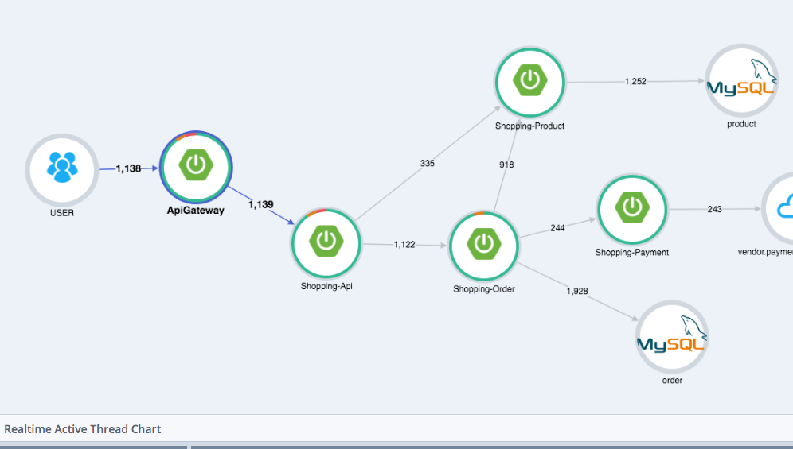

# Monitoring Study

## Metric Reporter
- [com.readytalk:metrics3-statsd](statsD/README.md)
- Spring Boot Actuactor
  - Spring study 참고

## Metric Collector(Optional)
Reporter에서 보낸 데이터를 받아서, Transformation/aggregation 등을 함. 
분산된 서버/프로세스에서 보내는 metric을 하나로 aggregation해서 보내는 듯..?
- [statsD](statsD/README.md)
    - 통계 데이터를 받아서, aggregation한 후에 Graphite와 같은 모니터링 저장서버로 전송. application log에 특화 되었고, 로그를 커스터마이징 할 수 있다고함
- CollectD
    - infrastructure와 application에 모두가능하고, 수집할 때 특별한 로직을 구현할 필요 없다고함.
    - 플러그인 추가를 통해 로직 구현 없이 적용 가능.
    - 적용 대상 : CPU, load, processes, df, disk, network, memory, rrdtool, apache, Nginx, MySQL, PostgreSQL, bind, java, Memcached, etc.
- [Telegraf](influxdb/telegraf.md)
    - InfluxDB와 같이 사용함.
    - statsD형식의 데이터를 받아서 처리하는 input plugin이 있음
    - 기본적인 플랫폼에 대한 input plugin이 있어서, 노코드로 가능함
## Storage
- [Influx DB](influxdb/README.md)
    - Telegraf, Grafana와 연동 가능
- [Graphite](graphite/README.md)
    - Grafana와 연동해서 주로 사용
- [Zabbix](zabbix/README.md)
    - 통합 솔루션. 하지만, grafana와 연동하거나 할 수 있으므로, Storage로 일단 분류.
- Prometheus
    - 통합 솔루션. Grafana와 연동 가능함
    - InfluxDB와 달리, pull 방식이라고 함.(influxDB는 pull방식도 지원. scraper)
## Visualization
- [Grafana](grafana/README.md)

## Solutions
- Pinpoint
  
  - 서버 구조를 한눈에 볼 수 있음.? 설정을 해줘야 하는지는 모르겠지만 좋아보임
- Whatap
- Zabbix

## Reference
[collecD vs statsD](https://www.metricfire.com/blog/collectd-vs-statsd/#:~:text=Collectd%20can%20be%20used%20for,counts%2C%20sets%2C%20and%20intervals.)
[Send StatsD Metrics to Telegraf](https://www.influxdata.com/blog/getting-started-with-sending-statsd-metrics-to-telegraf-influxdb/)